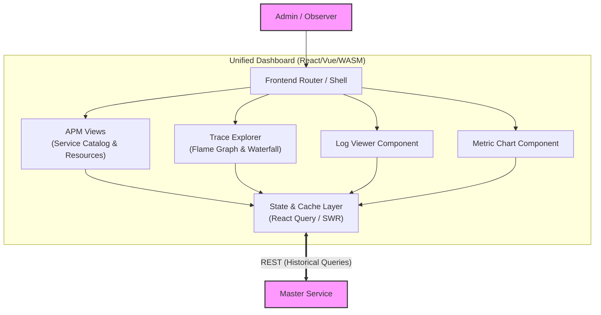

# Low-Level Architecture: Unified Dashboard

## 1. Role & Responsibility
The Unified Dashboard replaces Grafana, Kibana, Datadog APM, and AlertManager UIs. It is the single pane of glass for all monitoring activities. This web application unifies logs, system metrics, application metrics, and deeply correlated distributed APM traces into one cohesive UI.

## 2. Architecture Diagram

## 3. Tech Stack
- **Framework Choices**: `React` (with TypeScript) / `Vue 3`, OR `Leptos` / `Yew`.
- **Styling**: Tailwind CSS.
- **Charts & Graphs**: Apache ECharts or uPlot for high-performance APM RED metric rendering.
- **APM Visualization**: Custom Canvas/D3 Flame Graph & Waterfall renderers.

## 4. APM & Distributed Tracing Views
To mimic and improve upon Datadog APM's fluidity, the Dashboard provides these fundamental APM features:

### A. The Service Catalog
- A top-level view listing every active **Service** monitored by the system (e.g., `web-api`, `billing-worker`).
- Displays aggregated **RED (Rate, Errors, Duration)** metrics auto-generated by the Master Service for the last 15 minutes.
- Evaluates health flags inherently (e.g., turning a Service 'Red' if error rates climb to >5%).

### B. Resource Page
- Clicking a Service drills down into its **Resources** (e.g., HTTP endpoint `POST /login` or DB Query `UPDATE users`).
- Shows line charts of latency percentiles (p50, p90, p99) strictly associated with that Resource.

### C. Trace Explorer & Flame Graphs
- Users can click on any request from the Resource Page to open its specific **Trace**.
- **Flame Graphs**: Every span within the Trace is rendered in an interactive waterfall chart showing exact execution times, parent-child execution blocking, and network latency.
- **Correlated Logs**: Passing the `trace_id`, the UI instantly fetches and displays all Log entries that occurred during that Trace synchronously.

## 5. Authentication & Performance
- **Client-Side Caching**: Aggressively cache Service Catalogs using `React Query`.
- **RBAC**: JWT token validation limits features based on Admin/Observer roles.
