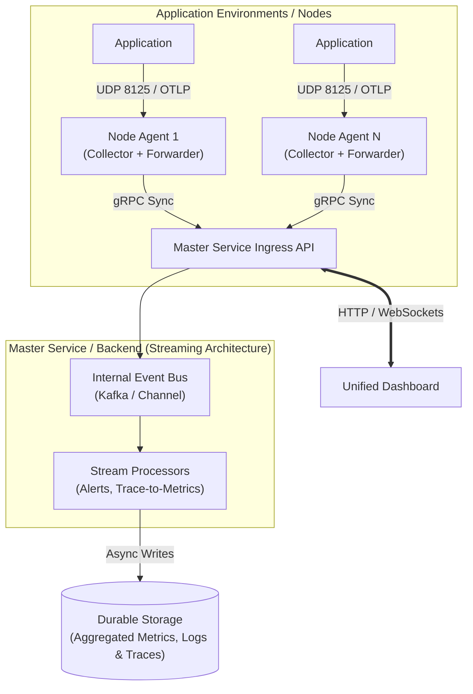

# Easy Monitor - High Level Architecture

## Overview
"Easy Monitor" is a unified, high-performance monitoring platform built entirely in Rust. It serves as a modern, lightweight alternative to the traditional monitoring stack, heavily inspired by Datadog's Agent and Cloud architecture. Easy Monitor provides a cohesive ecosystem with **one unified dashboard** for Logs, Metrics, Alerts, and APM Distributed Traces.

## Architecture Diagram

## APM & Tracing Terminology (Datadog Inspired)
- **Trace**: The end-to-end execution path of a single request.
- **Span**: A single logical unit of work within a trace.
- **Service**: Processes doing the same job (e.g., `checkout-service`).
- **Resource**: An endpoint or query (e.g., `POST /checkout`).
- **Tags**: Key-value pairs adding metadata to Spans.

## Core Components (Datadog Pattern)
### 1. Master Service (Cloud Backend Equivalent)
Emulates a highly decoupled cloud backend.
- **Role**: Receives synchronized data from Node Agents. Instead of writing directly to the database, it publishes the payloads to an internal **Event Bus**. Background stream-processing workers parse this bus to compute RED metrics, evaluate Alerts in real-time, and asynchronously write to durable storage without blocking the ingestion API.

### 2. Node Agent (Data Collector & Forwarder)
Mirrors the robust Datadog Agent architecture.
- **Collector**: Runs integration checks, pulls host metrics, and receives local custom metrics (via a local UDP StatsD server called `DogStatsD`).
- **Forwarder**: A separate component inside the agent that reads the buffered data from local storage, compresses it, and batches the payload to the Master Service over gRPC.

### 3. Unified Dashboard
A single web interface presenting correlated logs, metrics, APM Service Catalogs, and Resource charts.

## Communication Patterns
### 1. Application to Monitor Platform (Ingress)
- **DogStatsD (Metrics)**: Applications push custom high-frequency metrics to `localhost:8125` (UDP) so the application absolutely never blocks on monitoring.
- **Trace Collection**: Applications push spans to the Node Agent via OTLP.

### 2. Monitor Service Ecosystem (Internal Communication)
- **Forwarder to Master Service**: **gRPC** streamed batches.
