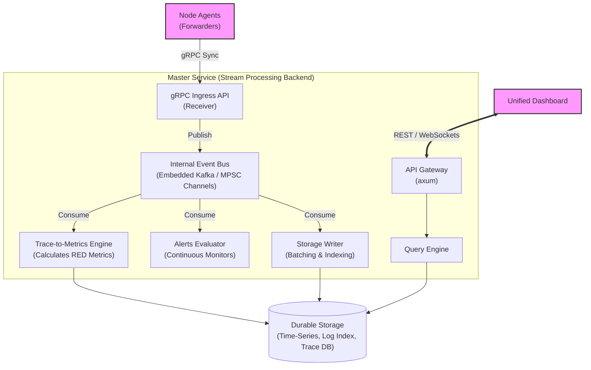

# Low-Level Architecture: Master Service

## 1. Role & Responsibility
The Master Service acts as the highly scalable "Cloud Backend" of the Easy Monitor platform. To handle massive throughput from thousands of Node Agents, it completely decouples the *Ingestion* of data from the *Processing* and *Storage* of data utilizing a Stream Processing pattern based on Datadog's cloud architecture.

## 2. Architecture Diagram

## 3. Tech Stack
- **Language**: Rust
- **Async Runtime**: `tokio`
- **RPC Framework**: `tonic`
- **Internal Event Bus**: `tokio::sync::broadcast` / `MPSC`, or embedded `Kafka` (`rdkafka`) if scaling horizontally.
- **Web Framework**: `axum`

## 4. The Streaming Ingestion Pipeline
When a Node Agent's **Forwarder** sends a `SyncMetrics` or `SyncLogs` batch, the gRPC Ingress API does **not** write to the database.
1. **Receive & Publish**: The Ingress authenticates the payload and immediately pushes the raw batch into the **Event Bus**. It then instantly returns a `SyncAck` to the Agent.
2. **Stream Processors (Consumers)**:
   - **Trace-to-Metrics Engine**: Consumes APM Spans, calculates RED metrics (Rate, Error, Duration) on the fly, and emits new metric payloads back into the bus.
   - **Alert Evaluator**: Consumes metrics and logs, holds a sliding window in memory, and triggers Alert Webhooks if thresholds are breached.
   - **Storage Writer (Flusher)**: Consumes all mature payloads and executes highly optimized, bulk-batched writes to the underlying Database (`tantivy` / `sled`).

This guarantees that a slow database write will **never** cause backpressure on the Node Agents or cause dropped metrics.

## 5. External API (Dashboard -> Master)
- `POST /api/v1/query/metrics` - Query custom and auto-generated RED metrics.
- `POST /api/v1/query/logs` - Query logs with full-text search.
- `POST /api/v1/query/traces` - Query distributed traces via `trace_id` or tags.

## 6. Database Design 
- **Time-Series Storage**: Vectorized/Columnar storage (`arrow` / `parquet`) optimized for heavy read aggregations.
- **Trace & Log Storage**: Fast search engine (`tantivy`) optimized for parent-child span reconstruction and Flame Graphs.
