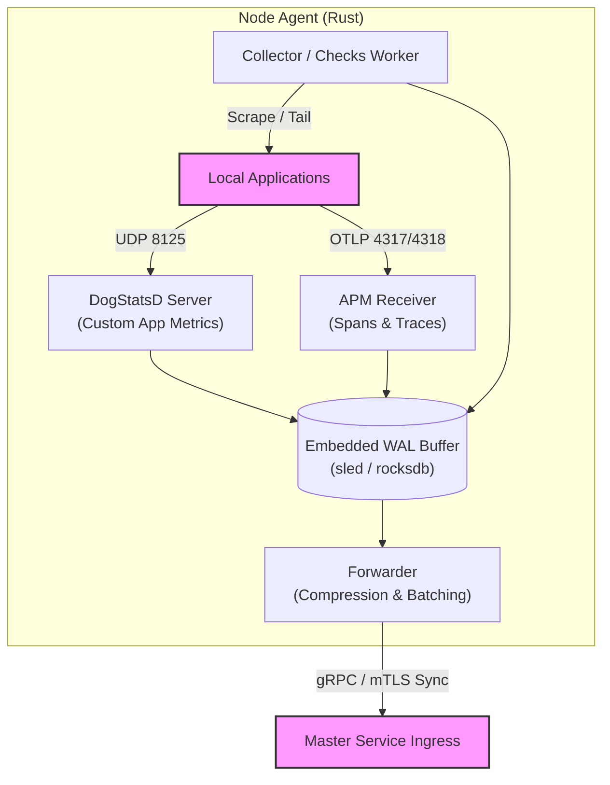

# Low-Level Architecture: Node Agent

## 1. Role & Responsibility
The Node Agent architecture is heavily modeled after the Datadog Agent. It strictly separates the concerns of gathering data (Collector / DogStatsD) from the transmission of data (Forwarder). It ensures application performance is never degraded by monitoring tasks.

## 2. Architecture Diagram

## 3. Core Capabilities (Datadog Agent Parity)

### A. The DogStatsD Server (Push Metrics)
To prevent blocking I/O in developer applications, the Agent runs a lightweight UDP server on `localhost:8125`. Applications fire-and-forget statsd/dogstatsd formatted packets (`custom_metric:1|c|#env:prod,service:web`). This is the fastest, lowest-overhead way to capture application metrics.

### B. The Collector (Pull Metrics & Logs)
The Collector runs scheduled "Checks" (background loops).
- Evaluates `sysinfo` for Host CPU/IO/Network.
- Scrapes Prometheus `/metrics` endpoints if configured.
- Tails configured application `.log` files using `notify`.

### C. The APM Receiver (Traces)
- Identical to Datadog's APM collector, it runs an OTLP-compatible receiver listening for complex distributed tracing span chains.
- Enforces W3C Trace Context and B3 header standardization.

### D. The Embedded WAL Buffer
Everything gathered by the DogStatsD Server, Collector, and APM Receiver is immediately written to an embedded, high-throughput Write-Ahead Log (like `sled`). It guarantees no data is lost during network partitions while decoupling ingestion from network latency.

### E. The Forwarder
The Forwarder is a dedicated background thread pool.
- It wakes up periodically, grabs chunks of serialized data from the WAL, applies aggressive `zstd` compression, and batches them.
- It transmits these payloads over a persistent gRPC connection to the Master Service (`SyncMetrics`, `SyncLogs`, `SyncTraces`).
- It deletes the local WAL entries *strictly* after receiving a `SyncAck` from the Master.
